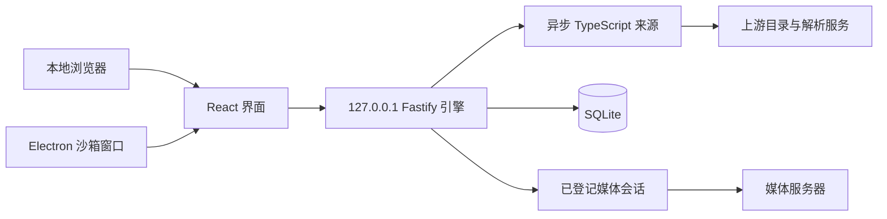

# 架构与运行约定

## 工程目录

```text
apps/web/       React + Vite + Router + TanStack Query
apps/desktop/   Electron 主进程及桌面运行依赖锁
packages/core/  数据契约、保守匹配、集数解析
packages/engine/
  src/sources/ AniCh Protobuf / Aki 静态页面适配器
  src/http.ts  独立 Cookie 会话、DNS 检查、重定向与流式网络请求
  src/media.ts 会话资源注册、HLS/MP4 转发、封面代理
  src/store.ts SQLite 与版本化事务迁移
  src/server.ts HTTP API、SSE、页面托管与本地访问控制
  src/runtime.ts 同资料目录单实例与动态端口
scripts/       构建、开发启动、打包、真实来源验收
tests/         固定样本、接口与浏览器流程
```



## 生命周期

- 引擎以排他文件锁保护资料目录，先检查已存端口与令牌对应的进程，再创建新服务。端口由系统分配，不占用固定产品端口。
- 网页入口拥有 Node 引擎；生产桌面使用 Electron utility process。两者启动时均先尝试连接已有同资料目录引擎。
- 桌面关闭最后一个窗口后仍可通过 Dock 恢复，退出应用才停止自己拥有的引擎。连接外部已有引擎时不会终止它。
- Cookie 存储在各来源的独立内存 Jar 中，不写进用户备份。进程退出后重新建立来源会话。
- 开发桌面先启动 Node 引擎，以避免 Node/Electron 原生 ABI 冲突；打包桌面在独立目录重新构建 SQLite，完全不依赖系统 Node。

## 本地 API

所有 `/api/v1/*` 接口要求应用会话 Cookie，测试与本机程序也可使用 Bearer 令牌。`/bootstrap` 仅以本机生成的随机令牌建立 HttpOnly / SameSite=Strict 会话，随后跳回首页。引擎只接受自己的 Host 和 Origin，不设置跨域允许头。

| 接口                                                         | 用途                                                      |
| ------------------------------------------------------------ | --------------------------------------------------------- |
| `GET /sources`、`PATCH /sources/:id`                         | 来源状态、启停、优先级                                    |
| `GET /home?sourceId=…`                                       | 单源推荐，前端独立加载                                    |
| `GET /search?q=…&sourceId=…&pages={…}&cursors={…}&session=…` | SSE：source、result、challenge、error、done；指定来源分页 |
| `GET /catalog?sourceId=…&page=…&filters={…}&cursor=…`        | 来源目录、组合筛选、真实分页                              |
| `GET /schedule?sourceId=…&weekday=1`                         | 来源周期表，1–7 对应周一至周日                            |
| `GET/DELETE /search-history`                                 | 最近搜索，支持逐条删除和清空                              |
| `GET /sources/:id/detail?itemId=…`                           | 来源详情与可用线路                                        |
| `POST /playbacks`                                            | EpisodeLocator → 本地播放会话                             |
| `POST /playback-lines`                                       | 查询 AniCh 当前集的其他线路                               |
| `POST /playbacks/:id/refresh`                                | 每会话最多重新解析一次                                    |
| `DELETE /playbacks/:id`                                      | 释放会话                                                  |
| `GET /media/:sessionId/:resourceId`                          | 仅转发已登记媒体，支持单一 Range                          |
| `GET /images/:id`                                            | 已登记封面代理                                            |
| `GET/POST /library`、`PATCH/DELETE /library/:id`             | 追番及明确的手动来源关联                                  |
| `POST /library/check`                                        | 合并重复的更新检查                                        |
| `GET/POST/DELETE /history`                                   | 最近记录及进度；每五秒和暂停/退出时保存                   |
| `GET/PUT /settings`                                          | 自动下一集、音量、倍速                                    |
| `GET /backup`、`POST /backup/restore`                        | 版本化备份与事务恢复                                      |
| `POST /cache/clear`、`GET /diagnostics`                      | 缓存管理及脱敏诊断                                        |

### 弹幕与观看人数

`Playback.features` 从来源能力与实际实现生成。girigiri 的弹幕与人数只接受已登记的播放会话 ID，由引擎使用解析后的媒体地址请求上游；浏览器不能传任意上游 URL。独立加载失败不会改变媒体健康状态或触发地址刷新。

- `GET /playbacks/:id/danmaku`：读取规范化弹幕；`?refresh=1` 主动刷新。引擎按来源版本与媒体地址的摘要合并请求，最多缓存 8 份、各 5 分钟；每份最多返回 20,000 条并标记截断。前端在切集卸载后释放会话缓存。
- `POST /playbacks/:id/audience`：首次登记，后续请求仅维持本机租约并返回同一个进入时快照。前端 30 秒一次本地心跳，90 秒未触达后回收；上游 `open` 不是人数查询，不能轮询。
- `POST /playbacks/:id/audience/close`：幂等离开，支持 `sendBeacon` 与 keepalive。乱序离开等待已发出的登记结束，再配对一次 `close`；关闭的 Session 永久封住重放，URL 刷新不增加第二次登记。
- 切集、删除/淘汰会话及正常退出均清理人数。登记、离开各最多等待 8 秒，版本交接明确收到退出 ACK 后最多等待 20 秒；数据库与旧锁保持到清理完成。
- `AppSettings.danmaku` 保存启用、透明度和字号；旧备份可省略。前端嵌套设置只合并实际更改的字段，并沿用 revision/generation 防止并发覆盖和恢复后旧写入。

协议、渲染和异常边界见 [弹幕与人数说明](DANMAKU.md)。

### 手动搜索验证码

`girigiri` 的关键词搜索遇到站点验证码时，适配器抛出 `CAPTCHA_REQUIRED`，引擎读取原图并通过 SSE `challenge` 事件给出本地图片地址和挑战 ID。事件流照常结束，人的输入时间不占用 12 秒来源请求时限。界面提交用户输入的四位数字后，引擎用原 Cookie 会话向站点验证，再读取原关键词与页码的结果。没有 OCR、远程识别服务或自动尝试数字。

- `GET /search/challenges/:id/image`：读取已登记图片；只接受 PNG/JPEG/GIF/WebP，最多 256 KB，`no-store`，与普通 API 使用相同鉴权。
- `POST /search/challenges/:id`：提交 `{code}`；返回 `result` 或含新图片的 `challenge`。错误数字不会自动重试。
- `POST /search/challenges/:id/refresh`：换一张；生成新 ID，旧图与旧输入作废。
- `DELETE /search/challenges/:id`：取消单个来源验证。`DELETE /search/sessions/:id`：离开搜索页、更换关键词或来源时释放该页的会话。

每个搜索页有独立随机 session，按 session + source 分配 Cookie Jar；同页分页保留已验证 Cookie，不与其他窗口合并待验证的请求。验证码图片 5 分钟失效，闲置会话 15 分钟回收，最多 32 个会话；同一会话的搜索、提交、换图串行处理。提交或换图的网络阶段最多 20 秒。原图、Cookie、输入数字只在请求/内存中使用，不进入 SQLite、备份或日志。上游仍可更早使验证码失效，界面会提示重新输入。

来源专用请求头、签名和 Cookie 不返回给前端。播放数据仅保存定位信息，临时媒体 URL 只存在引擎内存的会话注册表中。

## 搜索与匹配

默认来源顺序以 girigiri 开始，已保存的用户排序覆盖默认值。各模块只加载选中来源，优先恢复该模块已保存的可用选择，再按默认顺序选择；网址可显式指定来源。

网页每次明确传入 `sourceId`，只调度当前来源；分页和续页标记的键必须属于该来源，否则返回 400。禁用来源、未知来源、无搜索能力分别返回明确错误。未指定 `sourceId` 的旧 API 保留聚合兼容能力，供已有诊断调用使用，用户界面不提供全部来源搜索。

单源搜索 12 秒截止时间；即使适配器忘记使用取消信号，调度器仍终止等待。分页、短期缓存、刷新和错误按来源独立处理。前端按来源 ID 与关键词重建状态，切源、退出或输入新关键词后立即取消请求并释放验证码会话；忽略不属于当前来源的事件。各模块默认来源独立保存到 SQLite 设置，网址可指定来源；不可用的显式来源不会自动改查其他来源。搜索返回时按来源和关键词恢复已返回的结果、游标与位置。

索引和周期表每次请求最多 25 秒，缓存五分钟；来源清单声明 `catalogFilters`、`catalogPagination` 和可选 `getCatalog/getSchedule` 能力。筛选项由引擎校验，不允许前端任意传入来源参数。AniCh 的 Protobuf 根消息字段 3 是下一页的续页标记，不能按页码计算 `skip`；Aki 使用普通页码。目录网址保存筛选、页码和已到达页面的标记，支持刷新与从详情返回。搜索页的类型/年份筛选只作用于已返回结果，并在界面注明范围。

最近搜索最多 20 条，规范化去重后保存在 SQLite 的版本化设置表中。JSON 备份增加可选 `searchHistory` 字段；旧格式仍能恢复，缺失时清空搜索记录。周期表只表示来源的放送安排，不生成未知更新时间或播放验证标记。

真实身份始终为来源 ID + 条目 ID。普通收藏只对精确来源身份去重，不按片名自动合并。关联由用户明确发起，先预览双方版本和合并影响再确认；自动候选匹配仍拒绝明确年份、季度或类型冲突，资料不完整不能视为同一版本。切换来源只有唯一集数与类型对应时续播，否则回到手动选集。

更新标识表示来源目录出现实际新增剧集，包括数量不变时的补档与特别篇，不表示它们全部可以播放；不会推断未知更新时间。旧计数提醒保留至用户明确确认。全部关联来源禁用或请求失败时保留之前的检查基线并显示错误。

## 网络与播放

- 只允许 HTTP(S)，拒绝 URL 用户凭据、本地、内网、保留和链路本地地址。默认端口为 80/443/8443；已验证 CDN 的其他端口只能由适配器声明精确 origin，不能由网页请求提供。当前仅稀饭声明联通 CDN 的 HTTPS 30443 端口。
- DNS 的全部地址必须可公开路由，并将检查后的地址固定到实际连接；每次重定向重新检查。跨域重定向去掉授权、Cookie 和 Origin。
- 支持运行环境的 HTTP(S) 代理；代理连接仍使用经检查的目标 IP，HTTPS 保留正确 SNI。API、HTML 和封面读取按代理、origin 与已检查 IP 复用连接，每次请求仍验证 DNS；IP 变更会使用新连接池。每个来源最多 32 个池，仅淘汰闲置连接。
- 媒体按需流式传输，利用 Node Stream 背压；MP4 保留 206、Content-Range、Content-Length 和 Accept-Ranges。
- HLS 经解析器检查后按属性列表重写 URI；保留标签、字节范围、IV 和查询参数。支持主清单、媒体清单、AES-128 密钥、初始化片段、字幕及常见低延迟标签。
- 尚不支持 HLS 变量替换、DRM、转码、需登录/验证码/页面执行的线路。无法解码时提供明确错误。
- 没有扩展名的媒体先读取少量响应识别 HLS/MP4。Safari 使用原生 HLS；Chrome / Electron 支持 MSE 时优先使用 hls.js，即使它们报告原生 HLS 能力。没有 MSE 但支持原生 HLS 时回退到 `<video>`。
- 日志仅保存来源、阶段、耗时、错误分类，不记录带签名的 URL、Cookie 或解析凭据。诊断保留最近 300 次来源操作。

## 数据与容量

普通元数据相同请求通过 `RequestCache` 合并；支持人工验证码的搜索不合并不同搜索页的待完成请求，取消按读取者分别处理；全部读取者退出时终止上游。缓存结果最多五分钟，最多 500 项，按最近使用淘汰；清缓存使用版本标记防止旧响应回写。girigiri 推荐和周期表额外共用一分钟原始首页，刷新参数会穿透这层缓存，清缓存也会一并清除。

SQLite 使用 WAL、忙等待及事务迁移；迁移前先检查点并备份，失败则回滚。JSON 恢复先完整验证身份一致性和重复记录，再备份当前数据并事务替换。旧历史列表 API 保留最近 1000 条的兼容行为；历史页面通过游标访问更早记录，续播通过每作品最新记录接口读取。数据库及导出保留最近 50000 条。

引擎缓存最多 500 项，播放会话最多 30 个、闲置两小时失效，达到上限时淘汰最久未使用的会话；播放请求和流式传输都会更新活跃时间。每会话资源最多 20000 项，封面注册最多 10000 项。视频不会整集缓存在内存。两窗口使用同一数据库；页面数据仍遵循查询缓存周期，刷新可读取另一窗口的最新变更。

### 评分资料

`GET /sources/:id/ratings?itemId=...` 独立读取 Bangumi 元数据；`GET /bangumi/search?q=...` 返回候选，`GET /bangumi/subjects/:id` 预览准确条目。`PUT /sources/:id/bangumi` 用 `{itemId, subjectId}` 保存用户确认的关联，`DELETE /sources/:id/bangumi?itemId=...` 删除。全部沿用本地鉴权。评分不参与播放解析，不改变来源健康；接口只接受片名、已注册来源或数字条目 ID，不接收任意代理 URL。详细缓存和匹配规则见 [评分说明](RATINGS.md)。

## v0.7.1 状态一致性补充

- `core/progress.ts` 统一完成、分组和续播目标；只对已确认的来源关联共享观看记录，剧集对应有歧义时手动选集。
- `engine/history-store.ts` 使用采样时间索引、每作品最新记录及游标分页；全局/作品/单集版本拒绝删除前的写入。资料库 `profile` 身份不进入便携备份。局部删除通知包含所属全局 epoch。
- `web/progress-queue.ts` 每集保留最新待写记录，失败后有界重试，确认成功后更新缓存；暂停未变化的样本不更新时间。当前浏览器的待写存储不等于跨浏览器/端口备份。
- 关联预览、取消追番撤销和背景更新分别使用版本/引用检查。更新任务最多三个作品并行，恢复时取消；旧任务不能覆盖新的来源关联。
- 自动备份通过 `engine/backups.ts` 统一校验与安全文件访问；预览无副作用，恢复仍由 Store 事务执行。
- 设置 `generation` 为独立持久身份，普通写入只递增 revision，恢复事务则同时更换 generation；迟到的普通设置及来源偏好请求不能覆盖恢复后的资料。该身份不进入便携备份。

新增接口（均沿用鉴权与 Origin 校验）：

| 接口                                                                   | 用途                                                         |
| ---------------------------------------------------------------------- | ------------------------------------------------------------ |
| `GET /history/entry`                                                   | 单集记录及保存版本；参数为完整 EpisodeLocator                |
| `GET /history/recent`                                                  | 每个来源作品一条最新记录，不受列表 1000 条限制               |
| `GET /history/page?q&refs&cursor&limit`                                | 搜索与游标分页，最多 100 条；refs 为 JSON SourceRef 数组     |
| `DELETE /history?key=…` 或 `?refs=…`                                   | 删除单集或作品，返回所属 epoch 和版本边界；无参数清空        |
| `POST /library/link/preview`、`POST /library/link`                     | 预览关联影响，凭短期 token 确认并原子合并                    |
| `PATCH /library/:id`                                                   | 新增 `unlinkRef` 与 `revision`；显式 `markSeen` 确认更新提醒 |
| `POST /library/undo`                                                   | 凭 DELETE 返回 token 撤销；60 秒、冲突不覆盖                 |
| `POST /library/check/start`、`GET /library/check/status`               | 启动/加入检查任务，获取进度与摘要；可指定单条                |
| `PATCH /settings/source-preferences`                                   | 按模块原子保存默认来源，保持设置 revision 递增               |
| `POST /backup/preview`                                                 | 上传备份校验与内容预览                                       |
| `GET /backup/files`、`GET /backup/files/:name`                         | 最近自动备份与下载                                           |
| `POST /backup/files/:name/preview`、`POST /backup/files/:name/restore` | 本地自动备份预览与回退，内容指纹避免预览后变更               |
